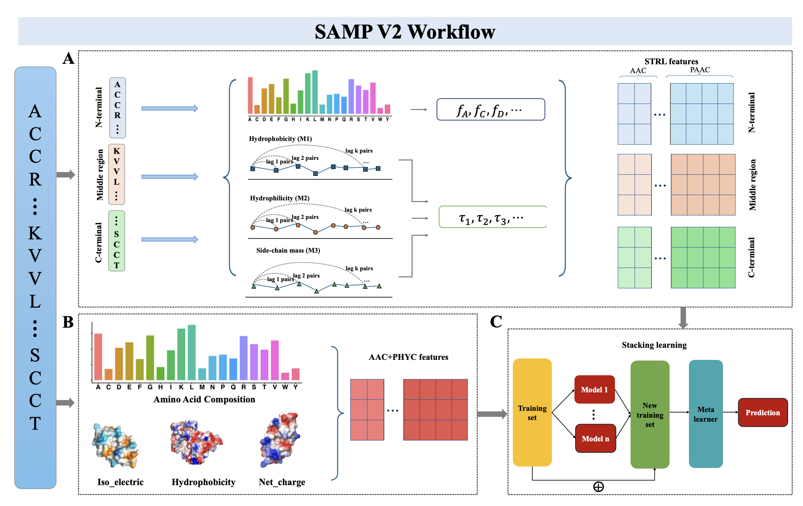

# SAMP V2

SAMPv2 is a stacking ensemble learning framework for antimicrobial peptide
prediction. The model uses sequence-derived feature matrices and combines
first-layer classifiers with a meta learner for final prediction.

## Workflow


## Repository Structure

```text
SAMP_V2/
  README.md
  LICENSE
  environment.yml
  sampv2/
    __init__.py
    metrics.py
    stacking.py
  scripts/
    train.py
  examples/
    README.md
  results/
    .gitkeep
```

## Installation

```bash
conda env create -f environment.yml
conda activate sampv2
pip install -e .
```

## Input Format

Training and test files should be CSV files with sample IDs in the first column.
Each row is one peptide sequence/sample, each feature is one column, and the
binary class label must be stored in a column named `labels`.
### Feature extraction
```bash
#### use extractFeatures funtion in extractFeatures.R file to prepare feature matrix:
extractFeatures(ampFile ='training_data_AMP.fasta',
              nonampFile = 'training_data_nonAMP.fasta',
              out = './training_data_features.csv',
              split1_prop = 0.2,split2_prop = 0.6)

extractFeatures(ampFile ='test_data_AMP.fasta',
              nonampFile = 'test_data_nonAMP.fasta',
              out = './test_data_features.csv',
              split1_prop = 0.2,split2_prop = 0.6)
```

## Usage

```bash
python scripts/train.py \
  --train examples/training_data_features \
  --test examples/test_data_features.csv \
  --output results/test_predictions.csv \
  --metrics-output results/metrics.csv \

```


## Tutorial

The original development notebook is currently stored as `sampv2.ipynb`.
For release, convert it into a tutorial notebook under `sampv2/` that imports
the package functions and uses relative example data paths.

## Citation

Citation information will be added after publication.

## Contact
If you have any questions, comments, or would like to report a bug, please contact msun@unmc.edu

## License

License pending. Please confirm the intended open-source license before public
release.
